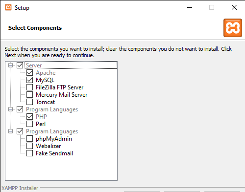
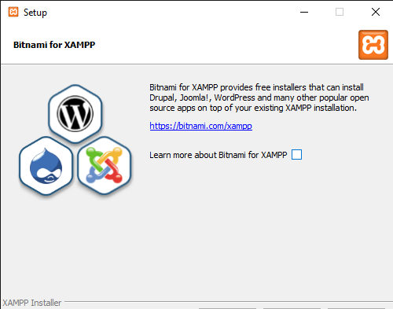
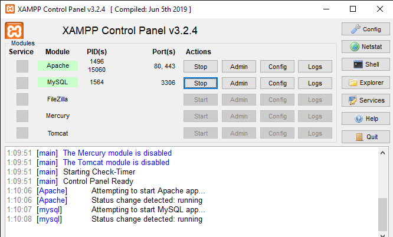
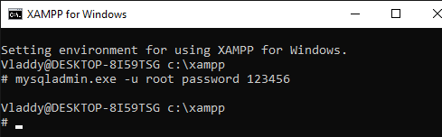
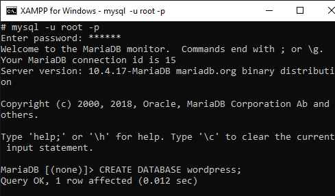
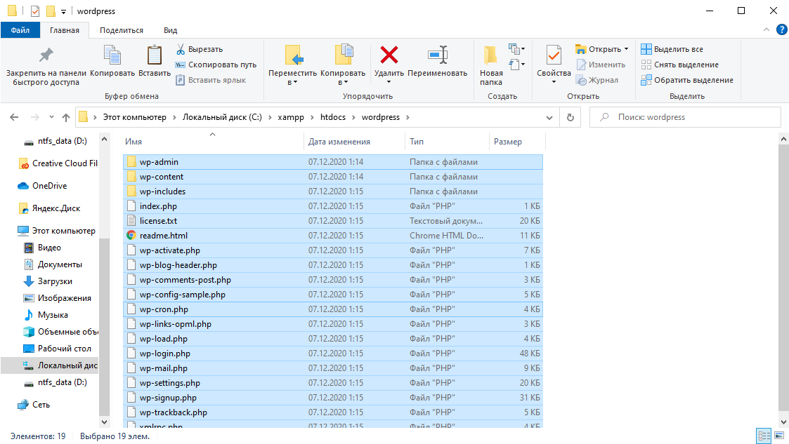
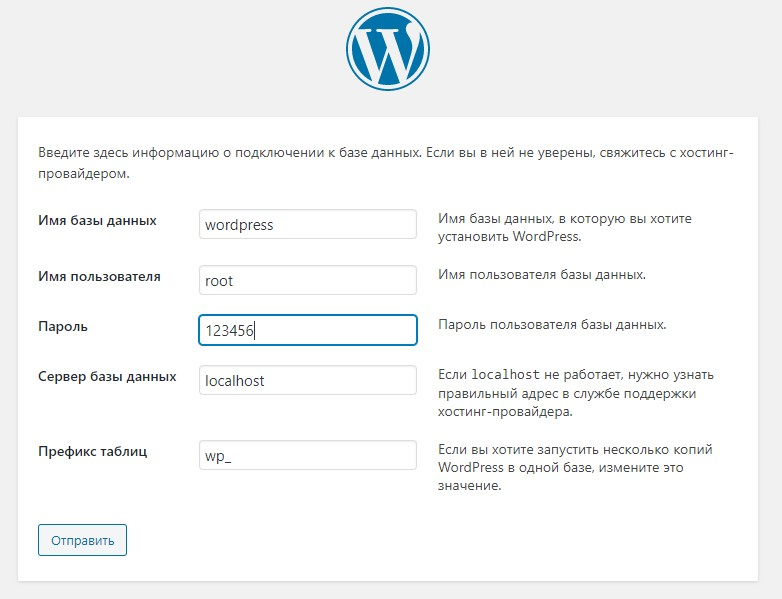
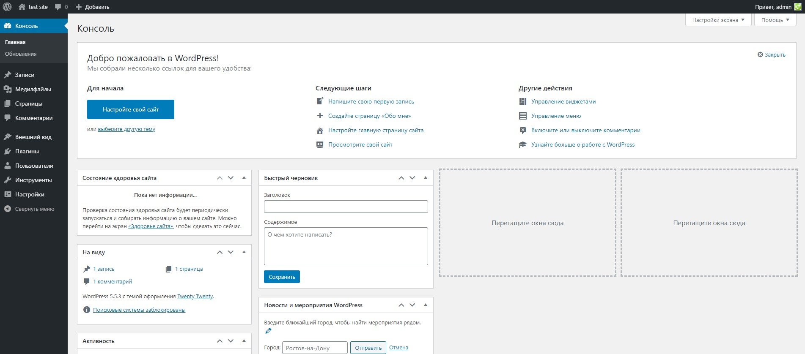

# Лабораторная работа №6 - Разворачивание локального веб-сервера (PHP)

## Цель работы

Изучение основных компонентов веб-сервера, локальная установка системы управления контентом (CMS).

## Ход работы

1. Прочитать задание лабораторной работы до конца.
2. Скачать и установить веб-сервер и систему управления базами данных (СУБД).
3. Создать БД для системы управления контентом (CMS).
4. Произвести установку CMS.
5. Настроить CMS: подобрать тему, блоки, меню и категории записей.
6. Заполнить CMS тестовыми записями.
7. Оформить и [отправить отчёт на google-форму](https://docs.google.com/forms/d/e/1FAIpQLSdt7ZHADnIrDQi00oa3HwKB52FPxoX1iPO712e-b7mAjm0psg/viewform?usp=sf_link).

## Об оформлении отчёта

В рамках выполнения лабораторной работы необходимо создавать скриншоты, демонстрирующие Ваши действия.
Таким образом крайне рекомендуется перед началом выполнения работы создать документ в любом текстовом процессоре (Microsoft Word или Google Docs) и делать в нём скриншоты.
Не стоит делать скриншот каждого клика мышкой или каждой экранной формы, но должно быть понимание, что эту работу делали Вы.

_P.S. Есть множество средств сравнения изображений. Можете попытаться обмануть систему, но проще просто сделать работу :)_

## Установка веб-сервера и СУБД

До этого Вы писали собственный сайт, который открывается в обычном браузере из памяти Вашего компьютера.
Также Вы разместили сайт на статический хостинг Github Pages.

Теперь пришло время научиться устанавливать собственный веб-сервер и размещать сайт на нём.

**Веб-сервер** - программное обеспечение, которое служит для отображения пользователям данных в вебе.
Прежде всего идёт речь про HTML-разметку (не обязательно на сервере хранятся файлы *.html), CSS-стили, JS-скрипты, изображения, видео-материалы и т.д.
Основная задача веб-сервера - реализация протоколов HTTP различных версий, которые отлично воспринимаются специальными клиентскими программами - **браузерами**.

Существует множество веб-серверов.
Самые популярные из них - Apache HTTP Server, Nginx, IIS.

**Apache HTTP Server** - веб-сервер с открытым исходным кодом.
Широко расширяем, легко запускается как на UNIX-подобных системах, так и на Windows.
Славится не очень хорошими настройками по умолчанию.

**Nginx** - отечественный веб-сервер также с открытым исходным кодом.
Очень простой и гибкий.
Обычно служит в качестве различных прокси-серверов.
Например, пользователи со всего Интернета могут обращаться к веб-серверу nginx, а он внутри будет перенаправлять (проксировать) запросы к другому веб-серверу (например, тому же Apache).
Такая связка используется очень много где и помогает распределить нагрузку и увеличить отказоустойчивость системы.

**IIS** - веб-сервер от Microsoft для запуска ~~начинающих устаревать~~ веб-приложений на технологиях этой корпорации.
Запускается только в Windows и жёстко связан с этой ОС (например, использует драйвер HTTP.sys).
У IIS закрытая реализация, однако относительно удобное администрирование.
Также IIS считается довольно быстрым веб-сервером как раз из-за жёсткой связи с Windows.

_P.S. Современные приложения на технологиях Microsoft могут запускаться не только на IIS и Windows, и это прекрасно!_

Веб-сервер по умолчанию может прослушивать специальный TCP-порт (80) и отдавать запрошенные файлы из конкретной папки на диске.
Например, можно настроить, чтобы при запросе http://127.0.0.1:80/ открывался бы файл _C:\\htdocs\\index.html_, а при http://127.0.0.1:80/test.png файл _C:\\htdocs\\test.png_.
Это самый простой способ работы сервера - отдавать статические файлы (по аналогии со статическим хостингом Github Pages).

Более сложный режим работы веб-сервера - добавление логики по обработке пользовательских запросов.
Это и есть т.н. backend или серверная часть веб-приложения.
Веб-приложение должно быть разработано на каком-либо языке программирования и взаимодействовать с веб-сервером.
Пример такого взаимодействия - протокол _FastCGI_.

Самый популярный язык программирования в вебе - **PHP**.
Вышло уже много версий этого языка, и до сих пор он не потерял свою популярность благодаря широкому сообществу, низкому порогу входа и простоте устновки на веб-сервер.
Вы могли слышать много баек про PHP-программистов, однако этот язык всё равно является самым популярным в вебе.

Также неотъемлемой частью бекенда является система управления базами данных, где могут храниться данные о пользователях.
Почти у каждого в макете сайта были формы входа, регистрации, оформления заказа.
А где эти данные должны храниться?
Как раз в базе данных.

Можно самостоятельно установить СУБД, веб-сервер, подключить к последнему язык программирования, однако существуют специальные сборки таких средств для локальной разработки и отладки.

Предлагаю установить среду разработки на PHP **XAMPP**: <https://www.apachefriends.org/ru/index.html>.

> Внимание! На текущий момент (декабрь 2020) лучше устанавливать XAMPP 7 с PHP 7 внутри.
> Стабильная поддержка PHP версии 8 есть не во всех приложениях.

При установке не забудьте снять ненужные флажки:

> Если хотите получить графическую среду по управлению СУБД, выберите дополнительно "PhpMyAdmin".

После установки среды разработки Вы сможете открыть панель управления:

Запустите веб-сервер и СУБД и проверьте, что сайт-приветствие открывается.

## Создание базы данных для CMS

В мире веба не все сайты разрабатываются с нуля (как это делали вы в прошлых лабораторных работах).
Если веб-сайт не очень сложный, например, состоящий из блога, пары изображений, пары страниц, и, может быть, страницы с заказом или оформлением доставки, то можно использовать готовые открытые разработки, настроенные под свои нужды.

Выделяют класс таких систем - **систем управления контентом** (Content Management System, CMS).
Благодаря им Вам не придётся самостоятельно создавать таблицы в базе данных, программировать работу с формами, их отображеием и т.д.

Самой популярной CMS является WordPress, и, вы не поверите, она написана на PHP!
Устанавливать и конфигурировать WordPress относительно легко, поэтому займёмся этим в данной лабораторной работе.
Полученные навыки позволяет установить любую другую CMS на Ваш выбор или выбор Вашего абстрактного заказчика.

Однако перед тем, как создать собственный сайт на WordPress, необходимо создать базу данных.

Перейдите в Shell из панели XAMPP.

Введите команду `mysqladmin.exe -u root password %ваш-пароль%`, чтобы задать пароль системному пользователю _root_:

Далее создадите БД при помощи команд `mysql  -u root -p` и `CREATE DATABASE wordpress;`:

## Установка WordPress

Для устновки WordPress скачайте архив с [официального сайта](https://ru.wordpress.org/) и распакуйте его в папку _C:\\xampp\\htdocs\\_:

Далее перейдите в браузере по адресу <http://localhost/wordpress/> и начнате установку.

Введите в форму выбора БД данные, которые вы указали при её создании:

Далее продолжите установку.

После окончания установки и ввода данных Вашего будущего сайта у Вас должна открыться панель администрирования:

В меню можно нажать на название сайта и перейти на него (ссылка есть выше).
Взгляните на Ваш уже практически полностью настроенный сайт!
Круто, не так ли?

## Настройка и заполнение CMS

Изучите возможности WordPress.

Существует возможность скачивать и устанавливать темы.
Практически любую тему можно настроить под себя: выбрать цвета, шрифты, форму блоков с данными, контент шапки, подвала и т.д.

Также можно определить записи и их категории.
Вообще запись - основная сущность WordPress.
Синоним - новость.
Также в WordPress есть понятие "Страница".
Пример страниц - контакты, "обо мне", "схема проезда" и т.д.

Можно настроить меню, чтобы нужные новостные категории или страницы отображались в нём в определённом порядке.

Можно устанавливать плагины.
Существуют как бесплатные дополнения, так и платные.
Один из самых популярных - _Contact Form 7_, позволяющий создавать формы обратной связи.

Для выполнения данного пункта выберите тему, настройте меню, шапку, подвал сайта, а также главную страницу согласно своей тематике.
Попробуйте добавить несколько записей и страниц.
Заметьте, что это намного проще, чем делать сайт с нуля.

> Помнится, 2 года назад за 15 минут набросал сайт <http://lenkom21.ru/>, который до сих пор жив, правда редко заполняется.
> Использовалась бесплатная тема и единственный дополнительный плагин - форма обращения старшему по дому.
> Кстати, если напишете туда гадости, старший по дому это увидит и расстроится.

## Вопросы для рассуждения

- Если CMS нетрудно настраивать и довольно легко сопровождать, почему нас учат основам вёрстки, таблиц стилей, браузерных скриптов?
- Можно ли на CMS разработать социальную сеть?
- Насколько быстрее будет работать сайт на CMS в отличие от написанного с нуля?
- Как понять, когда следует использовать CMS, а когда начинать разработку "с чистого листа"?
- Насколько безопасно использовать CMS? А собственный код? А если он ещё и написан не самым лучшим образом?
- Что дешевле сопровождать - сайт на CMS или собственноручно написанный движок?
- Насколько сложно сделать свою CMS? (Кстати, ваш ассистент в школе таким баловался ещё на PHP 4 или 5. Как хорошо, что этот код не сохранился...)
- Как думаете, сайт политеха сделан на CMS? Отвечу сразу - [да, на разработанной в политехе же в 2005 году](http://www.sisadminov.net/main/view/article/16).
