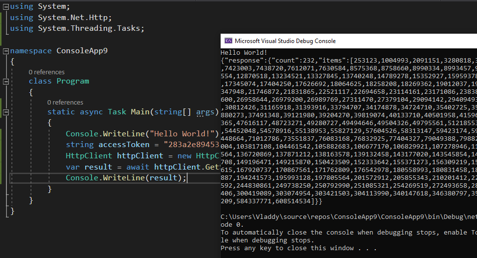
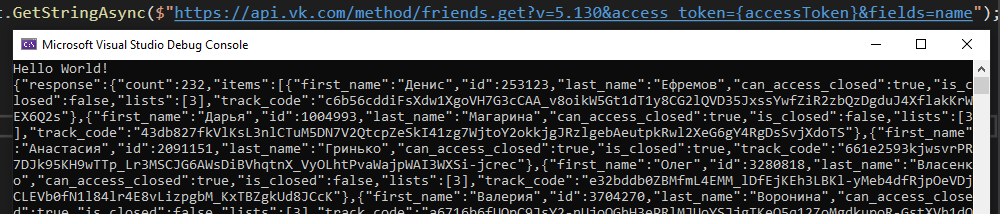
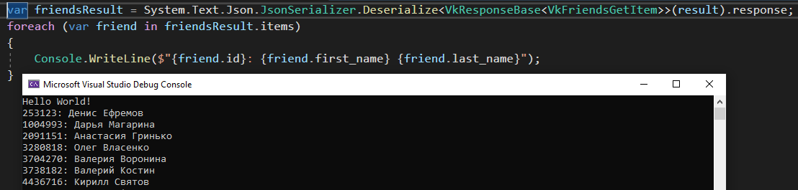

# Лабораторная работа №11 - Вызов методов API стороннего сервиса

## Цель работы

Получение опытов по взаимодействию со сторонним API.

## Ход выполнения работы

До этого вы разрабатывали собственное API, пусть и элементарное.
Теперь пришла очередь вызывать методы API от сторонних сервисов.

В качестве стороннего сервиса предлагается использовать VK.
Социальная сеть предоставляет достаточно много данных, они интересны, их можно увидеть воочию помимо API на страницах сайта.

Всё, что нам необходимо знать об интеграции с VK можно найти здесь: <https://vk.com/dev>.
Ещё интересная ссылка оттуда же: <https://vk.com/dev/first_guide>.
Однако многие вещи там излишни, поэтому попробую немного упростить.

Для доступа к данным VK необходимо отправлять HTTP-запросы (обычно с методом _GET_) на специальный адрес, в котором указывается секция, метод и его параметры.

Ответ приходит в формате _JSON_, знакомым нам из лекций.

Приложений для VK можно написать много.
Мы же для тестирования API будем разрабатывать обычное консольное приложение.
Для этого существует тип "Standalone-приложение".

Для большинства запросов необходимо определять, от имени кого (какого пользователя или сообщества) возвращать данные.
Например, некоторые пользователи могут не иметь доступа к записям закрытых сообществ, например, а другие будут иметь.
Поэтому надо указывать, от какого пользователя выполняется запрос.
Но не всё так просто, потому что нельзя просто так взять и выполнить запрос от любого имени.
Надо сделать так, чтобы пользователь дал разрешение вашему приложению работать от его имени и выполнять _строго определённые_ действия.
Результатом этого разрешения будет специальный ключ доступа (_access_token_), который необходимо приписывать к запросам в качестве параметра: в документации написано как.
Кстати, стоит отметить, что access_token не вечный, поэтому обычно разрешения на вызов API от имени пользователя действуют ограниченное время, например, 1 час или 1 сутки.

Итак, нам надо получить _access_token_, чтобы начать вызывать методы API.
Для этого воспользуйтесь инструкцией по _Implicit flow_ [отсюда](https://vk.com/dev/first_guide).

> Кстати, списков методов API у VK реально много.
> Их можно посмотреть здесь: <https://vk.com/dev/methods>.

Когда ключ доступа получен, переходите к созданию консольного приложения.

В данном примере буду приводить код на _.NET 5 (C#)_, однако вы можете использовать любой язык программирования, на котором можно отправлять HTTP-запросы.

Типичное консольное приложение состоит из метода `Main()`, в котором мы можем писать свой код.

Давайте сначала объявим переменную с _access_token_: `string accessToken = "ТУТ_ТО_ЧТО_НЕЛЬЗЯ_НИКОМУ_ПОКАЗЫВАТЬ_ИНАЧЕ_ВЗЛОМАЮТ";`.

Также давайте создадим экземпляр клиента HTTP: `HttpClient httpClient = new HttpClient();`.
Возможно понадобится подключить пространство имён: `using System.Net.Http;`.

Теперь попробуем получить список друзей текущего пользователя.
Для этого необходимо воспользоваться [этим методом](https://vk.com/dev/friends.get).
Тогда ссылка будет выглядеть так: `https://api.vk.com/method/friends.get?v=5.130&access_token=XXX`.

Попробуйем получить данные по этой ссылки при помощи нашего клиента: `var result = await httpClient.GetStringAsync($"https://api.vk.com/method/friends.get?v=5.130&access_token={accessToken}");`.
Если случилась беда, и среда разработки ругается на `async`, то надо заменить `static void Main` на `static async Task Main` и подключить `using System.Threading.Tasks;`.

Теперь выведем результат на экран при помощи `Console.WriteLine(result);` и получим примерно следующее:



У нас вернулся список _id_ друзей текущего пользователя.
Но это же скучно!
Давайте выведем ещё и ФИО.
Для этого стоит добавить параметр `&fields=name`.

Вывод будет уже более осмысленным, но всё равно некрасивым:



Например, перед нами стоит задача отобразить ИД и ФИО людей построчно, т.к. на каждой новой строке должно быть ИД и ФИО.
В данном случае нам поможет десериализация (вспомните, что это такое)!

Для того, чтобы преобразовать строчку с ответом от _VK API_, необходимо создать классы для правильного представления ответа от веб-сервиса.

Для нашего решения будет следующий набор:

```
class VkResponseBase<T>
{
    public VkResponse<T> response { get; set; }
}

class VkResponse<T>
{
    public long? count { get; set; }

    public T[] items { get; set; }
}

class VkFriendsGetItem
{
    public long id { get; set; }

    public string first_name { get; set; }

    public string last_name { get; set; }
}
```

> Два из трёх классов вам точно пригодятся далее.

Список друзей тогда можно будет получить при помощи `var friendsResult = System.Text.Json.JsonSerializer.Deserialize<VkResponseBase<VkFriendsGetItem>>(result).response;`, а получить доступ в цикле к каждому другу через `foreach (var friend in friendsResult.items)`.
Получится что-то вроде такого:



Ваша задача будет заключаться в следующем:

1. Необходимо найти с помощью цепочки вызовов _VK API_ самого близкого друга (сортировка `hints`) и вывести его друзей, но только тех, кому нельзя писать личные сообщения.
2. Также у этого друга необходимо вывести список пользователей, кто на него подписан (используется другой метод API).
3. Ещё необходимо получить _id_, фамилию и имя текущего пользователя (также другой метод API) и вывести людей с такими же ФИО (ещё один метод API).
  Стоит при выдаче результата добавить, что _id_ пользователя должен отличаться от _id_ текущего пользователя.

Скриншоты работы программы, исходный код (**с испорченным access_token**) следует оформить в отчёт.

## Оформление и отправка отчёта

Титульный лист должен содержать ФИО, группу, номер работы, название.
В тексте отчёта необходимо указать цель работы и результат выполнения.
Если произошли трудности при выполнении работы, также укажите их, пожалуйста.

После создания отчёта его необходимо преобразовать в документ pdf (в вашего покорного слуги нет MS Word, к сожалению), сохранить в облако и ссылку (проверьте её в режиме инкогнито) отправить в [эту гугл-форму](https://forms.gle/VnuTyM6w9LLc96bg6).
